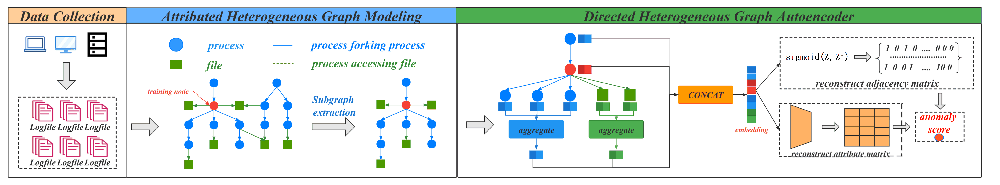

Anomaly Process Detection via Heterogeneous Graph Autoencoder
============

## DHetGraphAE

This is the PyTorch source code of paper "Anomaly Process Detection via Heterogeneous Graph Autoencoder".

## Abstract
The host-based intrusion detection system (HIDS) is widely used to safeguard the security of the enterprise environment and the main detection target of HIDS is the anomaly process. HIDS makes extensive use of the provenance graph which models the interactions between processes and other system entities (e.g. files), to assign anomaly scores to processes based on expert experience. However, the nonlinear and hierarchical interactions on the provenance graph cannot be captured by expert experience. To tackle this problem, we propose **DHetGraphAE**(<u>D</u>irected <u>Het</u>erogeneous <u>Graph</u> <u>A</u>uto<u>E</u>ncoder), an unsupervised method to detect anomaly processes by mining the provenance graph. Specifically, we model the provenance graph as the attributed heterogeneous graph. Then we encode the structure and node attributes of the graph into a vector through the directed heterogeneous graph neural network. Finally, the vector is fed into the decoder to calculate the reconstruction error, which is taken as the anomaly score of the process. We apply **DHetGraphAE** into a real enterprise data set. Extensive experiments have verified **DHetGraphAE** is superior to the baseline, especially in reducing false positives, which is significant to enterprises. 

## Framework

## Requirements
- python==3.7.0
- PyTorch=1.7.1

## Dataset
- data: The **data** folder holds our original log files.Our dataset comes from a real enterprise environment, so we only provide some samples for illustration purposes.We use "RANDOM" instead of sensitive information.
- train_data: The **train_data** folder holds the training data set generated after preprocessing, containing information about the attributes of processes and files, as well as information about process-process and process-file relationships.Due to the file size, the complete training data is stored on Google Cloud Drive and uploaded subsequently.
- test_data: The **test_data** folder holds the testing data set generated after preprocessing, containing information about the attributes of processes and files, as well as information about process-process and process-file relationships.Please extract the zip package in the directory and overwrite this folder.

## Code
- model.py is the script for DHetGraphAE;
- getTrainData.py and getTestData.py is the scripts for pre-processing;
- train.py and test.py is the scripts to train and test our model;
- ROC.py is the script for our model to plot the ROC curve;

If you have any other related needs, please contact us by **zhulin@bupt.edu.cn**!

